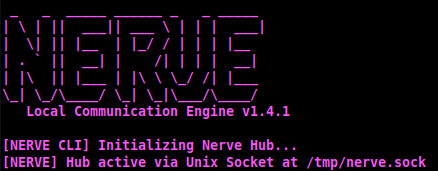
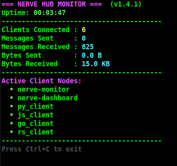
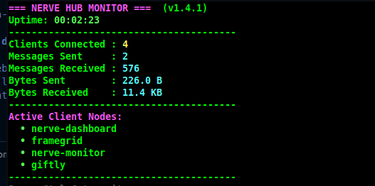
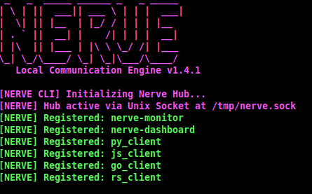
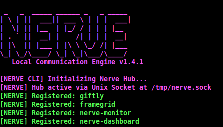
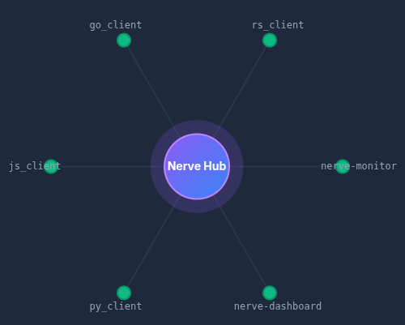
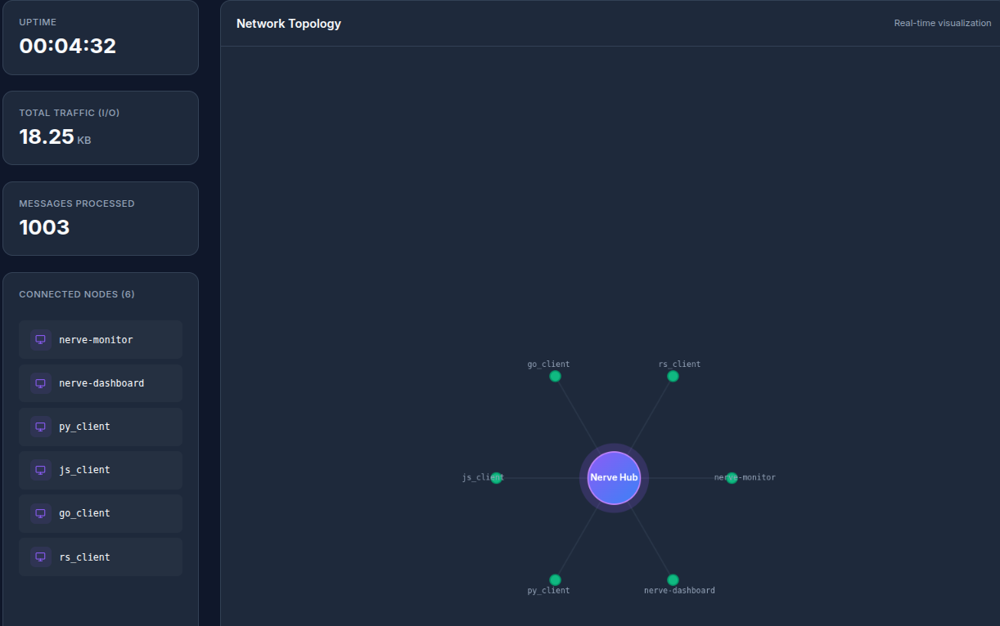

<div align="center">
  <h1>Nerve</h1>
  <p><b>Sistema Nervioso Descentralizado para Sockets Locales.</b></p>
  
  [](https://pypi.org/project/alenia-nerve/)
  [](https://github.com/Kaia-Alenia/alenia-nerve)
  [](LICENSE)
  [](https://ko-fi.com/aleniastudios)

  <br>
  <p><i><b>Soberanía, Velocidad y Privacidad Absoluta.</b> Nerve es el motor de comunicación entre procesos (IPC) local multiplataforma diseñado por <b>Alenia Studios</b> para transferencia de datos y archivos offline entre aplicaciones de escritorio, scripts y microservicios, requiriendo cero dependencias en la nube.</i></p>
</div>

---

##  ¿Para qué sirve Nerve?

Nerve está diseñado para desarrolladores que necesitan conectar múltiples programas, scripts o microservicios locales para que intercambien datos en tiempo real con una latencia de submilisegundos. En lugar de ejecutar un servidor web local pesado (como Flask o FastAPI) que abre puertos públicos, o escribir en archivos compartidos propensos a bloqueos, Nerve crea un bus de comunicación local seguro y ultrarrápido.

### Casos de Uso Principales:
* **Microservicios Locales y Aplicaciones de Escritorio:** Vincula un frontend moderno (Electron, Tauri, Flutter) con un backend pesado en Python o un modelo de IA local.
* **Transferencia de Archivos Offline:** Mueve contenedores seguros y datos binarios entre procesos aislados de forma instantánea.
* **Pipelines de Datos en Tiempo Real e IA:** Transmite datos (audio, video, texto) entre nodos de procesamiento. Si un nodo de IA falla, Nerve lo reconecta automáticamente.
* **Automatización y Orquestación de Scripts:** Coordina tareas en segundo plano (colectores de logs, scripts de respaldo automático, scrapers) y agrega sus salidas.
* **Comunicación Políglota:** Conecta programas escritos en diferentes lenguajes (Python, Rust, C++, Go) utilizando JSON simple delimitado por líneas sobre sockets locales estándar.

---

##  El Concepto: Redes Locales Soberanas

En el desarrollo de software moderno, la privacidad de tus datos, recursos y lógica interna es primordial. **Nerve** actúa como un bus de datos local ultrarrápido, permitiendo que procesos independientes (como aplicaciones de escritorio, pipelines de procesamiento de datos, y herramientas de automatización) se sincronicen y compartan archivos en tiempo real con latencia de submilisegundos, sin enviar un solo byte fuera de tu estación de trabajo física.

---

## Núcleo Nativo Multiplataforma ✓

Nerve es totalmente multiplataforma y se adapta dinámicamente al sistema operativo anfitrión para ofrecer la mejor latencia local posible:

* [](#) **Linux y macOS**: Utiliza **Unix Domain Sockets (UDS)** nativos a través de `socket.AF_UNIX` en `/tmp/nerve.sock` para tuberías de memoria directa de alto rendimiento.
* [](#) **Windows**: Alterna dinámicamente a una conexión **TCP local** especializada a través de `socket.AF_INET` en `127.0.0.1:50505`, garantizando compatibilidad al 100% en estaciones de trabajo de desarrolladores sin modificar una sola línea de lógica de tus herramientas.

---

##  Características Principales ⚠ ⚠

* **Multiplataforma**: No requiere configuración; funciona sin ajustes previos en Windows, Linux y macOS.
* **Enmarcado por Líneas**: Manejo robusto de paquetes usando delimitadores de nueva línea (`\n`) para evitar colisiones de datos bajo alto rendimiento.
* **Arquitectura Hub-Cliente**: Un coordinador central único (`NexusHub`) dirige el enrutamiento inteligente de mensajes a nodos registrados específicos (`NexusClient`).
* **Auto-Reconexión Industrial**: `NexusClient` se reconecta automáticamente cada 2 segundos si el Hub se reinicia, protegiendo las aplicaciones anfitrionas de fallos.
* **Latidos (Heartbeats) en Segundo Plano**: El Hub emite pings cada 5 segundos para detectar y purgar conexiones inactivas.
* **Soporte para Configuración Externa**: Personaliza puertos y rutas de socket mediante un archivo `nerve.config` sin tocar el código.
* **Modo Verbose**: Ejecuta con `--verbose` para trazar cada paquete enrutado a través del Hub en tiempo real.

---

##  Clientes Soportados e Integración

Nerve está estructurado como un Monorepo que contiene el Hub principal y las bibliotecas de cliente oficiales. A continuación puedes encontrar la instalación y un ejemplo simple de integración para cada lenguaje soportado.

### Cliente Python y Hub CLI

[](#)
[](https://pypi.org/project/alenia-nerve/)
[](https://pypi.org/project/alenia-nerve/)

✓ **Instalación:**
```bash
python3 -m venv alenia_env
source alenia_env/bin/activate   # En Windows: alenia_env\Scriptsctivate
pip install alenia-nerve
```

✓ **Ejemplo Simple de Integración:**
```python
from nerve import NexusClient

client = NexusClient()
client.connect("mi_herramienta_python")

# Enviar a un nodo específico
client.send("renderer", {"progress": 100, "status": "DONE"})

# Escuchar mensajes entrantes
def on_message(data):
    print(f"Recibido: {data}")

client.listen(on_message)
```

---

### Cliente Rust

[](#)
[](https://crates.io/crates/alenia-nerve)
[](https://docs.rs/alenia-nerve)

✓ **Instalación:**
```bash
cargo add alenia-nerve
```

✓ **Ejemplo Simple de Integración:**
```rust
use alenia_nerve::{NexusClient, ConnectionAddress};
use std::time::Duration;

#[tokio::main]
async fn main() -> Result<(), Box<dyn std::error::Error + Send + Sync>> {
    let mut client = NexusClient::new(Duration::from_secs(1), "", None);
    client.connect("mi_herramienta_rust").await?;

    client.send("renderer", serde_json::json!({"status": "ready"}))?;

    client.listen(|msg| println!("Recibido: {}", msg), None).await;
    Ok(())
}
```

---

### Cliente JavaScript / Node.js

[](#)
[](https://www.npmjs.com/package/alenia-nerve)
[](https://www.npmjs.com/package/alenia-nerve)

✓ **Instalación:**
```bash
npm install alenia-nerve
```

✓ **Ejemplo Simple de Integración:**
```javascript
const { NexusClient } = require("alenia-nerve");

const client = new NexusClient();
await client.connect("mi_herramienta_js");

client.send("renderer", { progress: 100, status: "DONE" });

client.listen((data) => {
    console.log("Recibido:", data);
});
```

---

### Cliente Go

[](#)
[](https://pkg.go.dev/github.com/Kaia-Alenia/alenia-nerve/clients/go)

✓ **Instalación:**
```bash
go get github.com/Kaia-Alenia/alenia-nerve/clients/go
```

✓ **Ejemplo Simple de Integración:**
```go
package main

import (
    "fmt"
    nerve "github.com/Kaia-Alenia/alenia-nerve/clients/go"
)

func main() {
    client := nerve.NewClient()
    client.Connect("mi_herramienta_go")

    client.Send("renderer", map[string]interface{}{"status": "ready"})

    client.Listen(func(data map[string]interface{}) {
        fmt.Println("Recibido:", data)
    })
}
```

---

### Empaquetado Seguro (.nrv)

Nerve incluye un empaquetador criptográfico de alto rendimiento por streaming diseñado para compartir recursos offline. Utiliza AES-256-GCM y Argon2id para asegurar carpetas o archivos en contenedores `.nrv`.

Para máxima seguridad, evita pasar la contraseña como argumento; usa la variable de entorno `NERVE_NRV_PASSWORD`:
```bash
NERVE_NRV_PASSWORD="mi_contraseña_segura" nerve pack ./mi_juego mi_juego.nrv
NERVE_NRV_PASSWORD="mi_contraseña_segura" nerve unpack mi_juego.nrv ./output
```
Si no se define la variable de entorno, la CLI solicitará la contraseña de forma interactiva. Si no tienes una contraseña, la CLI te ofrecerá generar una frase de contraseña altamente segura (usando Diceware con la lista EFF). También puedes generar contraseñas seguras independientes usando el comando `nerve genpass`.

---

##  Interfaz de Línea de Comandos (CLI) y el Hub Principal

Una vez instalado, el comando `nerve` proporciona un conjunto de herramientas para administrar tu red IPC local y asegurar archivos.

### Comandos Disponibles

* **`nerve start`**: Inicia el **NexusHub** — el enrutador central de mensajes para tu red local. Se ejecuta de inmediato sin necesidad de configuración y escucha las conexiones entrantes. Usa `nerve start --verbose` para rastrear en tiempo real cada paquete enrutado.
* **`nerve monitor`**: Lanza un panel interactivo en terminal que muestra todos los clientes conectados, tiempo de actividad, conteo de mensajes y estadísticas de tráfico en un solo vistazo.
* **`nerve dashboard`**: Inicia una interfaz web local ligera en `http://localhost:8080` que renderiza una **Vista de Topología de Red** en vivo con todos los nodos conectados.
* **`nerve bridge`**: Inicia un proxy HTTP/WebSocket en el puerto 50506. Esto permite que navegadores web y clientes WebSocket se conecten y hablen directamente con la red IPC de Nerve. (Requiere el paquete `websockets`).
* **`nerve pack <origen> <salida.nrv>`**: Encripta de forma segura y empaqueta un archivo o directorio en un contenedor `.nrv` usando AES-256-GCM.
* **`nerve unpack <nrv> <salida>`**: Desencripta y extrae un contenedor `.nrv` en el directorio de salida especificado.
* **`nerve open <archivo.nrv>`**: Abre de forma interactiva un contenedor `.nrv`, manejando las solicitudes de contraseña mediante TTY o diálogos de interfaz gráfica nativos (Zenity/Tkinter/macOS osascript) con hasta 3 intentos de reintento.
* **`nerve associate`**: Registra la extensión de archivo `.nrv` en tu sistema operativo (Windows/macOS/Linux) y la asocia con el comando `nerve open` y un ícono personalizado, habilitando la extracción con doble clic.
* **`nerve unassociate`**: Elimina la asociación de la extensión de archivo `.nrv` de tu sistema operativo.
* **`nerve genpass`**: Genera una contraseña o frase de contraseña altamente segura. Usa `--mode random` (longitud por defecto 20) o `--mode passphrase` (por defecto 5 palabras).

### Iniciando el Hub

```bash
nerve start
```

<div align="center">
  
  <br><sub>El Hub se inicializa instantáneamente y escucha conexiones de clientes vía Unix Domain Socket.</sub>
</div>

<br>

### Menú de Ayuda:
```bash
nerve --help
```

---

##  Herramientas de Monitoreo: CLI y Web Dashboard

Nerve incluye potentes herramientas integradas para observar tu red local en tiempo real — sin requerir servicios externos en la nube.

### CLI Monitor Global (`nerve-monitor`)

Un panel interactivo basado en terminal que muestra todos los clientes conectados, tiempo de actividad (uptime), conteo de mensajes y estadísticas de tráfico en un solo vistazo.

<p align="center">
  
  &nbsp;
  
</p>

*Monitoreo en tiempo real de clientes de múltiples lenguajes y aplicaciones de producción conectadas simultáneamente.*

---

### Logs del Hub (`nerve start`)

Los registros del terminal del Hub muestran cada evento de registro, ruta de mensaje y desconexión con una salida a color. Esto es lo que el servidor ve cuando las aplicaciones cliente se conectan.

<p align="center">
  
  &nbsp;
  
</p>

*Secuencia de arranque del Hub y registro transparente de eventos y reconexiones automáticas.*

---

### Web Dashboard (`nerve-dashboard`)

Una interfaz web local ligera que renderiza una **Vista de Topología de Red** en vivo — un grafo de cada nodo conectado — además del tiempo de actividad, tráfico total y contadores de mensajes.

<p align="center">
  
  &nbsp;
  
</p>

*Izquierda: Grafo de topología de los nodos interconectados. Derecha: Panel completo con la barra lateral de métricas en vivo mostrando el tráfico (ej. 18.25 KB) y mensajes procesados.*

---

## 🏭 Casos de Uso Reales en Producción

Nerve fue construido para operar en entornos exigentes. Actualmente, orquesta el ecosistema de herramientas de **Alenia Studios**, sirviendo como el puente de comunicación en tiempo real para aplicaciones pesadas de escritorio:

* **Framegrid:** Herramienta avanzada de procesamiento de imágenes y hojas de sprites.
* **Giftly:** Renderizador de exportaciones y automatización de GIFs.

*(Echa un vistazo a nuestro monorepo [zenith-nerve-tools](https://github.com/Kaia-Alenia/zenith-nerve-tools) para ver la implementación de estas herramientas de producción construidas enteramente sobre la arquitectura de Nerve).*

---


##  Archivo de Configuración (`nerve.config`)

Coloca un archivo `nerve.config` en la raíz de tu proyecto para personalizar las rutas de socket o los puertos TCP sin cambiar el código:

**Formato JSON:**
```json
{
  "socket_path": "/tmp/nerve.sock",
  "port": 50505,
  "host": "127.0.0.1"
}
```

**Formato clave-valor simple:**
```text
socket_path=/tmp/nerve.sock
port=50505
```

---

## 🤝 Contribuidores

¡Queremos expresar nuestro más profundo agradecimiento a todas las personas que contribuyen a Nerve! Su trabajo, revisiones y reportes de errores hacen que este proyecto sea posible.

* **Alenia Studios** - Mantenedor Principal y Publicador

¿Quieres aparecer aquí? Revisa nuestra guía [CONTRIBUTING.md](CONTRIBUTING.md) y envía un Pull Request. Visita [CONTRIBUTORS.md](CONTRIBUTORS.md) para ver la lista completa.

Consulta [CHANGELOG.md](CHANGELOG.md) para ver el historial completo de versiones.

---

## 📜 Licencia

[](LICENSE)

Este software se distribuye bajo la **Licencia Pública General de GNU v3 (GPL v3)**. Consulta [LICENSE](LICENSE) para más detalles.

---
*Elaborado con pasión por Alenia Studios para impulsar a creadores de videojuegos soberanos.*
