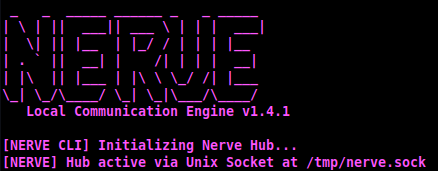
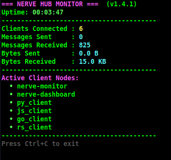
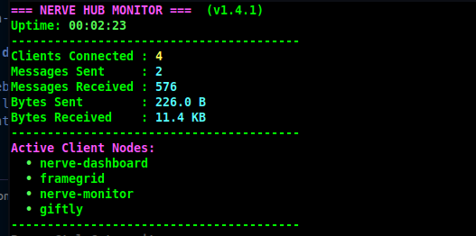
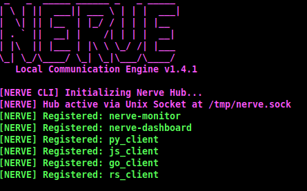
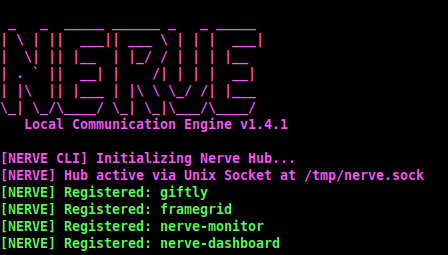
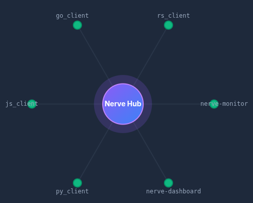
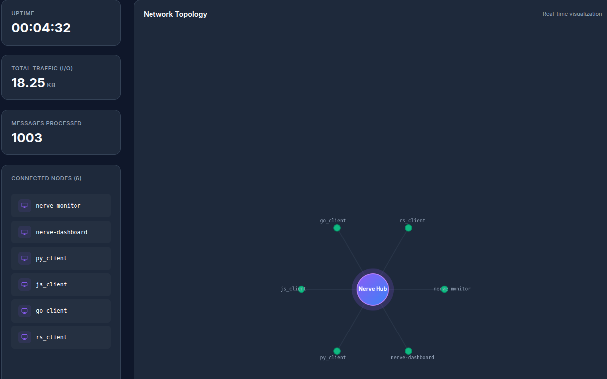

<div align="center">
  <h1>Nerve</h1>
  <p><b>Decentralized Nervous System for Local Sockets.</b></p>
  
  [](https://pypi.org/project/alenia-nerve/)
  [](https://github.com/Kaia-Alenia/alenia-nerve)
  [](LICENSE)
  [](https://ko-fi.com/aleniastudios)

  <br>
  <p><i><b>Sovereignty, Speed, and Complete Privacy.</b> Nerve is the cross-platform local inter-process communication engine designed by <b>Alenia Studios</b> to orchestrate game development tools locally, requiring zero cloud dependency.</i></p>
</div>

---

##  What is Nerve for?

Nerve is designed for developers who need to connect multiple local programs, scripts, or microservices so they can exchange data in real-time with sub-millisecond latency. Instead of running a heavy local web server (like Flask or FastAPI) that opens public ports, or writing to lock-prone shared files, Nerve creates a secure, ultra-fast, local communication bus.

### Core Use Cases:
* **Local Microservices & Desktop Apps:** Link a modern frontend (Electron, Tauri, Flutter) to a heavy Python backend or local AI model.
* **AI & Real-Time Data Pipelines:** Stream data (audio, video, text) between processing nodes. If an AI node crashes, Nerve automatically reconnects it.
* **Automation & Script Orchestration:** Coordinate background tasks (log collectors, auto-backup scripts, scrapers) and aggregate their outputs.
* **Polyglot Communication:** Connect programs written in different languages (Python, Rust, C++, Go) using simple line-based JSON over standard local sockets.

---

##  The Concept: Sovereign Local Networks

In modern game development, the privacy of your assets, source code, and metadata is paramount. **Nerve** acts as an ultra-fast local data bus, allowing independent processes (such as sprite slicers, gif renderers, and system monitors) to sync in real-time with sub-millisecond latency, without sending a single byte outside your physical workstation.

---

##  Multi-Platform Native Core ✓

Nerve is fully cross-platform and dynamically adapts to the host operating system to deliver the best local latency possible:

* [](#) **Linux & macOS**: Utilizes native **Unix Domain Sockets (UDS)** via `socket.AF_UNIX` at `/tmp/nerve.sock` for high-performance direct memory piping.
* [](#) **Windows**: Dynamically falls back to a specialized **local TCP connection** via `socket.AF_INET` at `127.0.0.1:50505`, ensuring 100% compatibility across developer workstations without modifying a single line of your tools' logic.

---

##  Key Features ⚠ ⚠

* **Cross-Platform**: Zero configuration required; runs out-of-the-box on Windows, Linux, and macOS.
* **Line-Based Framing**: Robust packet handling using newline delimiters (`\n`) to prevent data collision or buffer merging under heavy throughput.
* **Hub-Client Architecture**: A single central coordinator (`NexusHub`) directs intelligent message routing to specific registered nodes (`NexusClient`).
* **Industrial Auto-Reconnection**: `NexusClient` automatically reconnects every 2 seconds if the Hub restarts, protecting host applications from crashes.
* **Background Heartbeats**: The Hub broadcasts ping packets every 5 seconds to detect and purge stale connections.
* **External Config Support**: Customize ports and socket paths via a `nerve.config` file without touching code.
* **Verbose Mode**: Run with `--verbose` to trace every packet routed through the Hub in real-time.

---

##  Supported Clients & Integration

Nerve is structured as a Monorepo containing the main Hub and official client libraries. Below you can find the installation and a simple integration example for each supported language.

### Python Client & CLI Hub

[](#)
[](https://pypi.org/project/alenia-nerve/)
[](https://pypi.org/project/alenia-nerve/)

✓ **Installation:**
```bash
python3 -m venv alenia_env
source alenia_env/bin/activate   # Windows: alenia_env\Scripts\activate
pip install alenia-nerve
```

✓ **Simple Integration Example:**
```python
from nerve import NexusClient

client = NexusClient()
client.connect("my_python_tool")

# Send to a specific node
client.send("renderer", {"progress": 100, "status": "DONE"})

# Listen for incoming messages
def on_message(data):
    print(f"Received: {data}")

client.listen(on_message)
```

---

### Rust Client

[](#)
[](https://crates.io/crates/alenia-nerve)
[](https://docs.rs/alenia-nerve)

✓ **Installation:**
```bash
cargo add alenia-nerve
```

✓ **Simple Integration Example:**
```rust
use alenia_nerve::{NexusClient, ConnectionAddress};
use std::time::Duration;

#[tokio::main]
async fn main() -> Result<(), Box<dyn std::error::Error + Send + Sync>> {
    let mut client = NexusClient::new(Duration::from_secs(1), "", None);
    client.connect("my_rust_tool").await?;

    client.send("renderer", serde_json::json!({"status": "ready"}))?;

    client.listen(|msg| println!("Received: {}", msg), None).await;
    Ok(())
}
```

---

### JavaScript / Node.js Client

[](#)
[](https://www.npmjs.com/package/alenia-nerve)
[](https://www.npmjs.com/package/alenia-nerve)

✓ **Installation:**
```bash
npm install alenia-nerve
```

✓ **Simple Integration Example:**
```javascript
const { NexusClient } = require("alenia-nerve");

const client = new NexusClient();
await client.connect("my_js_tool");

client.send("renderer", { progress: 100, status: "DONE" });

client.listen((data) => {
    console.log("Received:", data);
});
```

---

### Go Client

[](#)
[](https://pkg.go.dev/github.com/Kaia-Alenia/alenia-nerve/clients/go)

✓ **Installation:**
```bash
go get github.com/Kaia-Alenia/alenia-nerve/clients/go
```

✓ **Simple Integration Example:**
```go
package main

import (
    "fmt"
    nerve "github.com/Kaia-Alenia/alenia-nerve/clients/go"
)

func main() {
    client := nerve.NewClient()
    client.Connect("my_go_tool")

    client.Send("renderer", map[string]interface{}{"status": "ready"})

    client.Listen(func(data map[string]interface{}) {
        fmt.Println("Received:", data)
    })
}
```

---

For a fully functional, production-ready implementation of Nerve working alongside Zenith in tools like Framegrid and Giftly, visit the [zenith-nerve-tools](https://github.com/Kaia-Alenia/zenith-nerve-tools) repository.


##  Command Line Interface (CLI) & The Main Hub

Once installed, start the central hub from any terminal:

```bash
nerve start
```

<div align="center">
  
  <br><sub>The Hub initializes instantly and listens for client connections via Unix Domain Socket.</sub>
</div>

<br>

This single command spins up the **NexusHub** — the central message router for your entire local network:
1. **Zero Configuration Needed:** Runs immediately with no setup. Acts as the brain that routes all messages between connected clients.
2. **Automatic Discovery:** Any `NexusClient` in your tools will auto-discover and connect to this Hub.

For real-time message tracing during development:
```bash
nerve start --verbose
```

### Help Menu:
```bash
nerve --help
```

---

##  Ecosystem Tools: CLI Monitor & Web Dashboard

Nerve ships with two powerful built-in tools to observe your local network in real-time — no external services required.

### Global CLI Monitor (`nerve-monitor`)

A terminal-based live dashboard that shows all connected clients, uptime, message counts, and traffic stats at a glance.

<p align="center">
  
  &nbsp;
  
</p>

*Left: All four official language clients connected simultaneously. Right: Real-world tools [Giftly and Framegrid](https://github.com/Kaia-Alenia/zenith-nerve-tools) connected invisibly — fully visible in the Hub.*

---

### Hub Logs (`nerve start`)

The Hub terminal logs every registration, message route, and disconnection event with colored output. This is what the server sees when clients connect.

<p align="center">
  
  &nbsp;
  
</p>

*Left: Hub boot sequence with all language clients registering (py, js, go, rs). Right: Giftly and Framegrid registering as native Nerve nodes.*

---

### Web Dashboard (`nerve-dashboard`)

A lightweight local web interface that renders a live **Network Topology View** — a graph of every connected node — plus uptime, total traffic, and message counters.

<p align="center">
  
  &nbsp;
  
</p>

*Left: Pure topology graph — the Nerve Hub at center, all nodes orbiting it. Right: Full dashboard with live metrics sidebar showing uptime, traffic (18.25 KB), and 1003 messages processed.*

*(Check out our [zenith-nerve-tools monorepo](https://github.com/Kaia-Alenia/zenith-nerve-tools) for practical real-world tools built on top of Nerve.)*

---


##  Configuration File (`nerve.config`)

Place a `nerve.config` file in your project root to customize socket paths or TCP ports without changing code:

**JSON format:**
```json
{
  "socket_path": "/tmp/nerve.sock",
  "port": 50505,
  "host": "127.0.0.1"
}
```

**Simple key-value format:**
```text
socket_path=/tmp/nerve.sock
port=50505
```

---

## 🤝 Contributors

We want to express our deepest gratitude to everyone who contributes to Nerve! Your work, reviews, and bug reports make this project possible.

* **Alenia Studios** - Lead Maintainer and Publisher

Want to appear here? Check our [CONTRIBUTING.md](CONTRIBUTING.md) guide and submit a Pull Request! See [CONTRIBUTORS.md](CONTRIBUTORS.md) for the full list.

See [CHANGELOG.md](CHANGELOG.md) for the full version history.

---

## 📜 License

[](LICENSE)

This software is distributed under the **GNU General Public License v3 (GPL v3)**. See [LICENSE](LICENSE) for more details.

---
*Crafted with passion by Alenia Studios to power sovereign game creators.*
