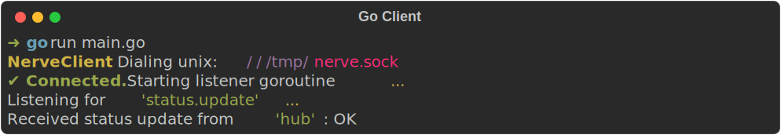

# Alenia Nerve - Go Client

  

Go client library for the [Alenia Nerve](https://github.com/Kaia-Alenia/alenia-nerve) local IPC engine.

## License
This software is distributed under the GNU General Public License v3 (GPL v3). See [LICENSE](../../LICENSE) for details.
Built by **Alenia Studios** — contact.aleniastudios@gmail.com
