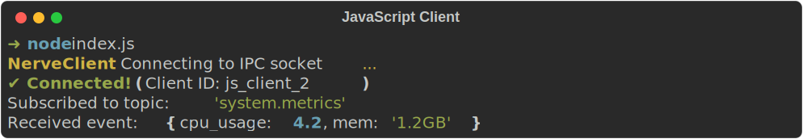

# Alenia Nerve — Cliente JavaScript

[](https://www.npmjs.com/package/alenia-nerve)
[](https://www.npmjs.com/package/alenia-nerve)
[](#)
[](#)
[](../../LICENSE)
[](https://ko-fi.com/aleniastudios)

<div align="center">
  
</div>

Biblioteca de cliente JavaScript/Node.js para el motor IPC local [Alenia Nerve](https://github.com/Kaia-Alenia/alenia-nerve).

## Instalación

Instala el paquete a través de npm:

```bash
npm install alenia-nerve
```

## Licencia
Este software se distribuye bajo la Licencia Pública General de GNU v3 (GPL v3). Consulta [LICENSE](../../LICENSE) para más detalles.
Construido por **Alenia Studios** — contact.aleniastudios@gmail.com
