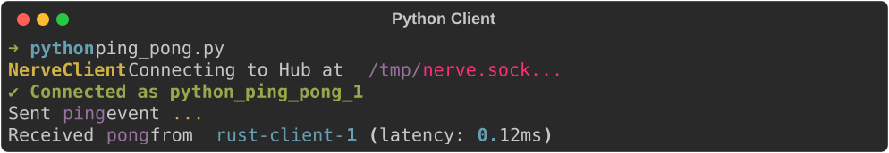

# Alenia Nerve - Cliente de Python y CLI Hub

Esta es la biblioteca de cliente oficial de Python y la Interfaz de Línea de Comandos (CLI) para Alenia Nerve, el motor de comunicación entre procesos (IPC) local y ultrarrápido.

## El Hub CLI de Nerve

El paquete de Python incluye la herramienta de línea de comandos central (`nerve`) utilizada para iniciar y administrar el Hub de enrutamiento IPC principal.



### Referencia de Comandos CLI

Nerve proporciona un conjunto completo de comandos para administrar el Hub IPC, monitorear el tráfico de mensajes y empaquetar/desempaquetar datos de forma segura.

#### Hub y Monitoreo
- **`nerve start`**: Inicia el Hub central de Nerve (proceso bloqueante). Usa `--verbose` para ver logs detallados de enrutamiento de mensajes en tiempo real.
- **`nerve monitor`**: Lanza una interfaz de terminal interactiva para ver estadísticas del Hub, nodos conectados y rendimiento de los mensajes en tiempo real.
- **`nerve dashboard`**: Inicia un panel web visual accesible en `http://localhost:8080` para monitorear la red local de Nerve.
- **`nerve bridge`**: Inicia el puente HTTP/WebSocket (puerto por defecto `50506`) para permitir que aplicaciones externas (ej. navegadores) se comuniquen de forma segura con la red local de Nerve.

#### Contenedores Seguros (.nrv)
Nerve incluye un formato de contenedor altamente seguro (`.nrv`) protegido con AES-GCM y Argon2id.

- **`nerve pack <src> <out.nrv>`**: Empaqueta un archivo o directorio en un contenedor seguro `.nrv`. Solicitará una contraseña o usará la variable de entorno `NERVE_NRV_PASSWORD`.
- **`nerve unpack <file.nrv> <out_dir>`**: Desencripta y desempaqueta un contenedor `.nrv` en el directorio de salida especificado.
- **`nerve open <file.nrv>`**: Comando interactivo para abrir un contenedor `.nrv`. Soporta hasta 3 intentos de contraseña y usa ventanas GUI nativas si se ejecuta fuera de una terminal.
- **`nerve associate`**: Registra la extensión `.nrv` en tu Sistema Operativo (Windows/macOS/Linux) y establece Nerve como la aplicación predeterminada para abrirlos.
- **`nerve unassociate`**: Elimina la asociación de archivos `.nrv` de tu sistema.
- **`nerve genpass [--mode random|passphrase] [--length N] [--words N]`**: Genera una contraseña aleatoria criptográficamente segura o una frase de contraseña (passphrase) fácil de recordar.

---

## Instalación del Cliente

Instala el paquete a través de pip:

```bash
pip install alenia-nerve
```

O instálalo globalmente omitiendo las restricciones de paquetes del sistema si es necesario (por ejemplo, dentro de contenedores Docker):

```bash
pip install alenia-nerve --break-system-packages
```

---

## Ejemplo de Integración

### 1. Inicializar el Cliente
Conéctate al hub local registrando un ID de cliente único.

```python
from nerve import NexusClient

client = NexusClient()
client.connect("my_python_node")
```

### 2. Enviar mensajes
Envía una carga útil JSON a otro nodo registrado:

```python
payload = {"status": "processing", "progress": 45}
client.send("renderer_node", payload)
```

### 3. Transmisión de mensajes (Broadcast)
Transmite una carga útil a todos los demás nodos conectados actualmente al Hub:

```python
client.broadcast({"event": "reload_assets"})
```

### 4. Escuchar transmisiones
Registra una función de callback para escuchar flujos de datos en tiempo real:

```python
def handle_incoming(data):
    print(f"Received: {data}")

client.listen(handle_incoming)
```

---

## Licencia

Este software se distribuye bajo la Licencia Pública General de GNU v3 (GPL v3).

## Créditos

El generador de contraseñas seguras utiliza la [EFF Large Wordlist](https://www.eff.org/files/2016/07/18/eff_large_wordlist.txt) creada por la Electronic Frontier Foundation, distribuida bajo la licencia [Creative Commons Attribution 3.0 License (CC BY 3.0)](https://creativecommons.org/licenses/by/3.0/).
