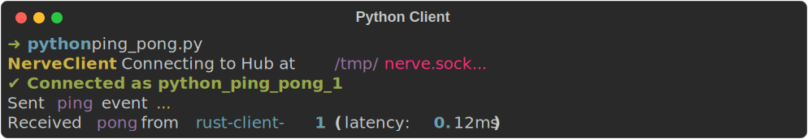

# Alenia Nerve - Python Client & CLI Hub

[](https://pypi.org/project/alenia-nerve/)
[](#)
[](../../LICENSE)

This is the official Python client library and Command Line Interface (CLI) for Alenia Nerve, the ultra-fast local inter-process communication (IPC) engine.

## The Nerve CLI Hub

The Python package includes the central CLI tool (`nerve`) used to boot and manage the central IPC routing Hub.

<div align="center">
  
</div>

### Running the Hub

Once installed, you can start the central hub from any terminal window:

```bash
nerve start
```

For detailed packet routing output, run the hub in verbose mode:

```bash
nerve start --verbose
```

---

## Client Installation

Install the package via pip:

```bash
pip install alenia-nerve
```

Or install it globally bypassing system package restrictions if needed (e.g., inside containers):

```bash
pip install alenia-nerve --break-system-packages
```

---

## Integration Example

### 1. Initialize Client
Connect to the local hub by registering a unique client ID.

```python
from nerve import NexusClient

client = NexusClient()
client.connect("my_python_node")
```

### 2. Send messages
Send a JSON-serializable payload directly to another registered node:

```python
payload = {"status": "processing", "progress": 45}
client.send("renderer_node", payload)
```

### 3. Broadcast messages
Broadcast a payload to every other node currently connected to the Hub:

```python
client.broadcast({"event": "reload_assets"})
```

### 4. Listen for streams
Register a callback function to listen to data streams in real-time:

```python
def handle_incoming(data):
    print(f"Received: {data}")

client.listen(handle_incoming)
```

---

## License

This software is distributed under the GNU General Public License v3 (GPL v3).
