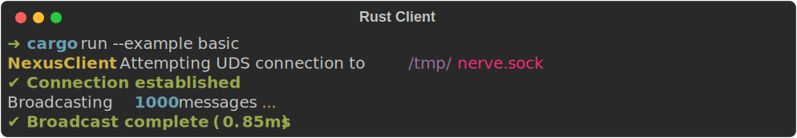

# alenia-nerve — Rust Client

[](https://crates.io/crates/alenia-nerve)
[](https://crates.io/crates/alenia-nerve)
[](https://docs.rs/alenia-nerve)
[](#)
[](#)
[](../../LICENSE)
[](https://ko-fi.com/aleniastudios)

<div align="center">
  
</div>

Rust client library for the [Alenia Nerve](https://github.com/Kaia-Alenia/alenia-nerve) local IPC engine.
Provides both an async (`NexusClient`) and a blocking/sync (`SyncNexusClient`) API over Unix Domain Sockets (Linux/macOS) or TCP (Windows).

## Installation

Install the crate using `cargo`:

```bash
cargo add alenia-nerve
```

Alternatively, add it manually to your `Cargo.toml`:

```toml
[dependencies]
alenia-nerve = "1.4.11"
```

## Quick Start

```rust
use alenia_nerve::{NexusClient, ConnectionAddress};
use std::time::Duration;

#[tokio::main]
async fn main() -> Result<(), Box<dyn std::error::Error + Send + Sync>> {
    let mut client = NexusClient::new(Duration::from_secs(1), "", None);
    client.connect("my-app").await?;

    client.send("other-app", serde_json::json!({"hello": "world"}))?;

    client
        .listen(
            |msg| println!("Received: {}", msg),
            None,
        )
        .await;

    Ok(())
}
```

## License

GNU General Public License v3.0 — see [LICENSE](../../LICENSE) for details.

Built by **Alenia Studios** — contact.aleniastudios@gmail.com
